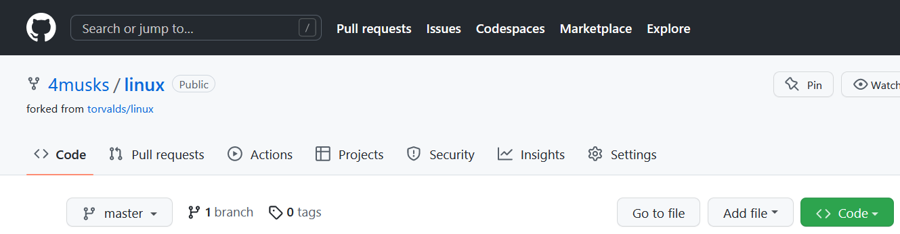
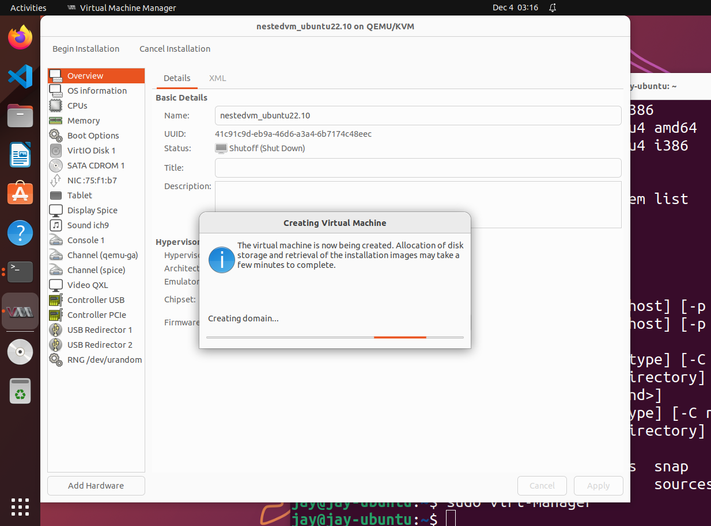
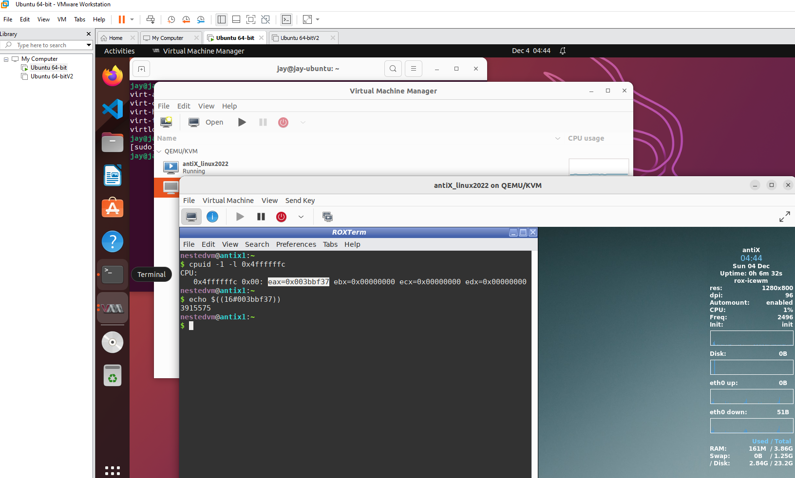
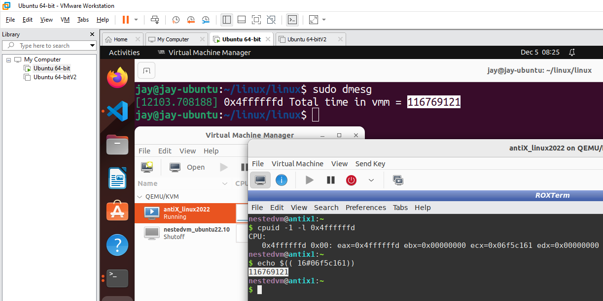
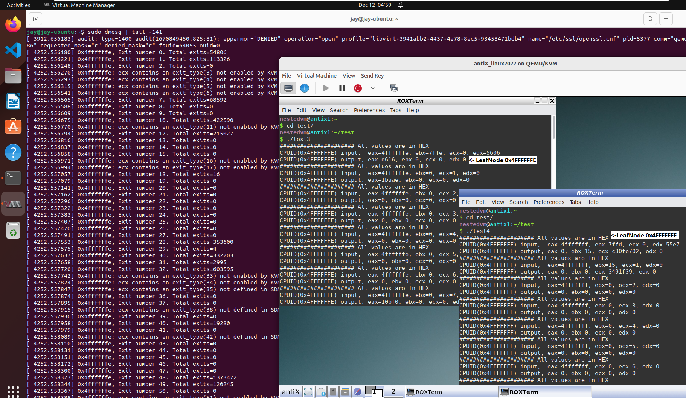
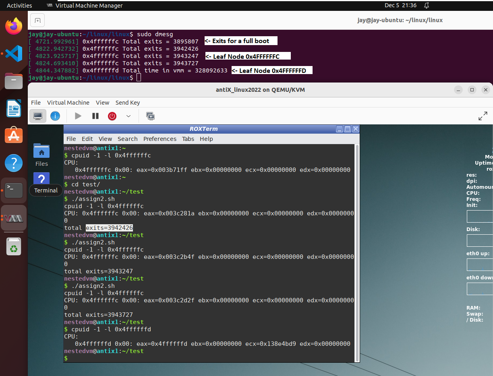

# FA22: CMPE-283 Sec 48 - Virtual Technologies 

**Assignment-2**

**Assignment-3**

Here are the steps detailed to execute Assignment-2 on Ubuntu VM hosted on VMWare Workstation.

## Contributors

**`JAYA KRISHNA THUPILI`**

## System & Prerequisites

- System Type: x64-based PC
- Processor: 12th Gen Intel(R) Core (TM) i7-1260P (12 Cores)
- Installed Physical Memory (RAM): 16.0 GB
- Windows 11 Professional
- VMware® Workstation 16 Pro [Trial/Download](https://www.vmware.com/products/workstation-pro.html)
- Ubuntu 22 [Download](https://releases.ubuntu.com/22.10/ubuntu-22.10-live-server-amd64.iso?_ga=2.70008919.652567418.1667472597-1208328021.1667382980)
- Antix Linux [Download](https://antixlinux.com/download/)
- Intel® 64 and IA-32 Architectures Software Developer Manuals (SDM) - [Download](https://www.intel.com/content/www/us/en/developer/articles/technical/intel-sdm.html)
  - For this assignment, SDM release version **_April 2022_** is referred.

## Enabling Nested Virtualization

To enable nested virtualization for VMs running on Windows 11

- Disable the default security features on Core Isolation.


- Turn-off the following windows features. Start > Type "**Turn Windows features on**"


## Installing Ubuntu

- Before creating Ubuntu VM using VMWare Workstation, enable the following options on VM > Settings > Processors


- Create a VM with 16 cores (8x2 cores), 8GB RAM and 200GB HDD and install Ubuntu.
- Once the VM is booted, verify that nested VMM capabilities are available.


## Fork Linux github repo

Fork Linux kernel <https://github.com/torvalds/linux> into your github account



## Clone your copy of Linux github repo

```bash
git clone https://github.com/4musks/linux.git
```

## Build the kernel using config options from your existing installation

```bash
jay@jay-ubuntu:~$ cd linux/linux/
jay@jay-ubuntu:~/linux/linux$ cp /boot/config-5.19.0-23-generic .config
jay@jay-ubuntu:~/linux/linux$ make oldconfig
jay@jay-ubuntu:~/linux/linux$ make -j 16 modules
jay@jay-ubuntu:~/linux/linux$ sudo make INSTALL_MOD_STRIP=1 modules_install
jay@jay-ubuntu:~/linux/linux$ sudo make install
jay@jay-ubuntu:~/linux/linux$ uname -a
'Linux jay-ubuntu _5.19.0-23-generic_ #24-Ubuntu SMP PREEMPT_DYNAMIC Fri Oct 14 15:39:57 UTC 2022 x86_64 x86_64 x86_64 GNU/Linux'
jay@jay-ubuntu:~/linux/linux$ sudo reboot
```

## Now the VM will boot using New kernel

This would be the **VMM** for Assignment 2 & 3.

```bash
jay@jay-ubuntu:~/linux/linux$ uname -a
'Linux jay-ubuntu 6.1.0-rc7+ #1 SMP PREEMPT_DYNAMIC Wed Nov 30 01:57:10 PST 2022 x86_64 x86_64 x86_64 GNU/Linux'
jay@jay-ubuntu:~/linux/linux$
```

## Make the relevant code changes to cpuid.c and vmc.c as detailed in the video

Video instructions should help you build code for leaf node **_0x4FFFFFFC_**

After code changes, we can just run `"make modules && make -j 16 modules_install"` and skip `"make install"`

## Verify if kvm module is loaded

If loaded, remove and re-load it.

If not, load it now.

```bash
jay@jay-ubuntu:~/linux/linux$ lsmod | grep kvm
kvm_intel             421888  0
kvm                  1134592  1 kvm_intel
```

Remove **KVM**.

```bash
jay@jay-ubuntu:~/linux/linux$ sudo rmmod  kvm_intel
jay@jay-ubuntu:~/linux/linux$ sudo rmmod  kvm
```

Load **KVM**.

```bash
jay@jay-ubuntu:~/linux/linux$ sudo modprobe kvm
jay@jay-ubuntu:~/linux/linux$ sudo modprobe kvm_intel
jay@jay-ubuntu:~/linux/linux$ lsmod | grep kvm
kvm_intel             421888  0
kvm                  1134592  1 kvm_intel
```

## Once all modules are loaded without errors, it is time to test the code

The new Kernel you have built is the **VMM**.

And we have enabled nested virtualization on the HOST system.

Taking advantage of that, you can now create a new VM (say nestedvm) on this VMM.

You can use ubuntu or a smaller sized ISO of debian distro. **antiX Linux** is a good choice.



## Log into nested VM and test the first leaf node `eax=0x4FFFFFFC` using **cpuid** tool

Update packages using `apt update`

Install package `cpuid`

Invoke CPUID instruction for `0x4FFFFFFC`

```bash
$ sudo apt-get update
$ sudo apt-get install cpuid
$ cpuid -1 -l 0x4ffffffc
# Convert HEX value of EAX to DECIMAL
$ echo $((16#<value of %eax>))
```



## Leaf Node 0x4FFFFFFD

vmx.c: Use function **rdtsc()** in the boundaries of `vmx_handle_exit` to compute cpu cycles. See ref: RDTSC

cpuid.c: Using bitwise _AND_ and _RIGHT SHIFT_ operators, compounded cpu cycles variable can be separated into 32 low and high bits registers. See ref: BITWISE OPERATORS

## Re-build and install modules

```bash
make -j 16 modules
make -j 16 INSTALL_MOD_STRIP=1 modules_install
```

## Re-load KVM modules

Stop nested VM, re-load KVM modules

```bash
jay@jay-ubuntu:~/linux/linux$ sudo rmmod  kvm_intel
jay@jay-ubuntu:~/linux/linux$ sudo rmmod  kvm
jay@jay-ubuntu:~/linux/linux$ sudo modprobe kvm
jay@jay-ubuntu:~/linux/linux$ sudo modprobe kvm_intel
jay@jay-ubuntu:~/linux/linux$ lsmod | grep kvm
kvm_intel             421888  0
kvm                  1134592  1 kvm_intel
```

## Log into nested VM and test the second leaf node `eax=0x4FFFFFFD` using **cpuid** tool

Compare the output with dmesg value on VMM.



## **Assignment 3: Leafnode eax=0x4FFFFFFE & eax=0x4FFFFFFF**

For Assignment 3, cpuid.c and vmx.c has the necessary code blocks with in-line comments.

Among VMX BASIC EXIT REASONS 0-69:

- Not defined in Intel SDM version April 2022 are: 35,38,42
- Not handled in KVM are: 3,4,5,6,11,16,17,33,34,51,63,64,65,66,67,68,69

## Log into nested VM and test the third leaf node `eax=0x4FFFFFFE` using program


```bash
> gcc test3.c -o test3
> ./test3
```

Compare output with dmesg output on VMM.


## Log into nested VM and test the final leaf node `eax=0x4FFFFFFF` using program


```bash
> gcc test4.c -o test4
> ./test4
```

Compare output with dmesg output on VMM.




## Q&A

Does the number of exits increase at a stable rate?

- No. Entirely dependent on the instruction being called and when

Are there more exits performed during certain VM operations?

- Yes. During VM boot procedure.

Approximately how many exits does a full VM boot entail?

- Varies for each VM and distro types. In my setup, I have computed it as **3895807**.



**Assignment 3**

- Of the exit types defined in the SDM, which are:
  - Most frequent
  
    [ 2850.258822] 0x4ffffffe, Exit number **48**. Total exits=**701051**

    **48: EPT violation**. An attempt to access memory with a guest-physical address was disallowed by the configuration of
the EPT paging structures.
  - Least frequent
  
    There are several basic exit reason(s) whose Total exits is **0**. Second least exit reason is **29**

    [ 2850.258436] 0x4ffffffe, Exit number **29**. Total exits=**2**

    **29: MOV DR**. Guest software attempted a MOV to or from a debug register and the “MOV-DR exiting” VM-execution control was 1.

```md
[SORTED]
[ 2850.258822] 0x4ffffffe, Exit number 48. Total exits=701051 <- Most frequent
[ 2850.258456] 0x4ffffffe, Exit number 30. Total exits=167017
[ 2850.258416] 0x4ffffffe, Exit number 28. Total exits=107108
[ 2850.258046] 0x4ffffffe, Exit number 10. Total exits=104368
[ 2850.258497] 0x4ffffffe, Exit number 32. Total exits=76189
[ 2850.257866] 0x4ffffffe, Exit number 1.  Total exits=60554
[ 2850.258843] 0x4ffffffe, Exit number 49. Total exits=30591
[ 2850.257831] 0x4ffffffe, Exit number 0.  Total exits=27399
[ 2850.258093] 0x4ffffffe, Exit number 12. Total exits=25009
[ 2850.257984] 0x4ffffffe, Exit number 7.  Total exits=14878
[ 2850.258659] 0x4ffffffe, Exit number 40. Total exits=3514
[ 2850.258477] 0x4ffffffe, Exit number 31. Total exits=729
[ 2850.258908] 0x4ffffffe, Exit number 54. Total exits=9
[ 2850.258215] 0x4ffffffe, Exit number 18. Total exits=7
[ 2850.258926] 0x4ffffffe, Exit number 55. Total exits=3
[ 2850.258436] 0x4ffffffe, Exit number 29. Total exits=2      <- Least frequent
[ 2850.257888] 0x4ffffffe, Exit number 2.  Total exits=0
[ 2850.258005] 0x4ffffffe, Exit number 8.  Total exits=0
[ 2850.258026] 0x4ffffffe, Exit number 9.  Total exits=0
```

## Unlicense

[](http://unlicense.org/)

## References

- [VMWare KB 76918: VMware workstation with hyper-v or device/credential guard enabled](https://kb.vmware.com/s/article/76918)
- [Disable Side Channel Mitigation in VMware Workstation (windowsloop.com)](https://windowsloop.com/disable-side-channel-mitigation-in-vmware/#:~:text=1%20First%2C%20open%20the%20VMware%20application.%20You%20can,re-open%20VMware%20Workstation%20to%20fully%20apply%20the%20changes.)
- [Ostechnix.com How-to-enable-nested-virtualization-in-kvm-in-linux](https://ostechnix.com/how-to-enable-nested-virtualization-in-kvm-in-linux/)
- [Create VM using VMM on Ubuntu](https://www.server-world.info/en/note?os=Ubuntu_22.04&p=kvm&f=3)

- [RDTSC](https://www.felixcloutier.com/x86/rdtsc)

- [BITWISE OPERATORS](https://www.programiz.com/c-programming/bitwise-operators)
